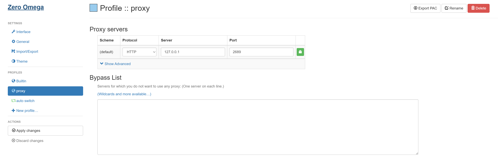

# Detailed Setup Guide

Complete step-by-step guide for installing and configuring akam-proxy.

## Table of Contents

- [Prerequisites](#prerequisites)
- [Installation](#installation)
- [Configuration](#configuration)
- [Browser Setup](#browser-setup)
- [Advanced Features](#advanced-features)
- [Verification](#verification)

## Prerequisites

### Required
- **Node.js** (v14+ recommended, tested with v24.x)
  - Download: https://nodejs.org/

### Optional (for automatic IP discovery)
- **Python 3.6+**
  - Windows: https://python.org/downloads/
  - Linux/Mac: Usually pre-installed

## Installation

### Step 1: Get the Code

```bash
git clone https://github.com/[your-repo]/akam-proxy
cd akam-proxy
```

Or download and extract the ZIP file.

### Step 2: Install Node Dependencies

```bash
npm install
```

This installs:
- `json5` - Config file parsing
- `tcp-ping` - IP latency testing
- `async` - Async control flow

### Step 3: Install Python Dependencies (Optional)

Only needed if you want automatic IP discovery:

```bash
cd tools/akamTester
pip install -r requirements.txt
cd ../..
```

## Configuration

### Basic Configuration

1. **Copy example config**:
   ```bash
   cp config/example.json5 config.json5
   ```

2. **Edit config.json5**:
   ```json5
   {
       host: 'upos-hz-mirrorakam.akamaized.net',
       port: 2689,  // Change if port is in use
       refreshInterval: 3600,
       akamTester: {
           enabled: false  // Set true for automatic IP discovery
       }
   }
   ```

### Port Configuration

If port 2689 is already in use:

1. Choose a different port (e.g., 3000, 8080):
   ```json5
   {
       port: 3000
   }
   ```

2. Update browser proxy settings to match

### Automatic IP Discovery (Optional)

Enable akamTester for hands-free operation:

```json5
{
    akamTester: {
        enabled: true,           // Enable feature
        interval: 900,           // Run every 15 minutes
        pythonPath: 'python',    // or 'python3' on Linux/Mac
        condaEnv: null,          // Optional: conda environment
        saveToFile: true,        // Save discovered IPs
        maxIps: 200              // Maximum IPs to keep
    }
}
```

## Browser Setup

### Option 1: ZeroOmega (Recommended)

1. **Install extension**:
   - Chrome: [ZeroOmega on Chrome Web Store](https://github.com/zero-peak/ZeroOmega)
   - Firefox: [ZeroOmega on Firefox Add-ons](https://github.com/zero-peak/ZeroOmega)

2. **Create proxy profile**:
   - Name: `akam-proxy` (or any name)
   - Protocol: `HTTP`
   - Server: `127.0.0.1`
   - Port: `2689` (or your custom port)

3. **Add auto-switch rule**:
   - Condition Type: `Host wildcard`
   - Pattern: `*.akamaized.net`
   - Profile: `akam-proxy`

4. **Save and activate**:
   - Click "Apply changes"
   - Select "Auto Switch" mode

**Screenshots**:


### Option 2: SwitchyOmega

Similar steps to ZeroOmega:

1. Install [SwitchyOmega](https://github.com/FelisCatus/SwitchyOmega)
2. Create HTTP proxy profile (127.0.0.1:2689)
3. Add switch rule for `*.akamaized.net`
4. Activate auto-switch mode

### Why Selective Proxy?

**Important**: This proxy ONLY optimizes Bilibili CDN traffic. Using "Proxy all requests" mode:
- Works, but unnecessary
- Routes all traffic through the proxy
- Only Bilibili CDN requests are actually optimized

Selective proxy mode is more efficient and secure.

## Advanced Features

### Manual IP Updates

If automatic discovery is disabled, update IPs periodically:

**Method 1: DNS Query**
```bash
nslookup upos-hz-mirrorakam.akamaized.net
# Copy IPs to data/ip_list.txt
```

**Method 2: akamTester**
```bash
cd tools/akamTester
python akamTester.py -u upos-hz-mirrorakam.akamaized.net
# Copy IPs from upos-hz-mirrorakam.akamaized.net_iplist.txt to data/ip_list.txt
```

### Using Conda Environments

If you use Anaconda/Miniconda:

```json5
{
    akamTester: {
        enabled: true,
        pythonPath: 'python',
        condaEnv: 'AKAMTester',  // Your conda environment name
        // ...
    }
}
```

Create environment:
```bash
conda create -n AKAMTester python=3.10
conda activate AKAMTester
cd tools/akamTester
pip install -r requirements.txt
```

### System-Wide Proxy (Advanced)

Instead of browser extension, configure OS proxy:

**Windows**:
- Settings → Network & Internet → Proxy
- Manual proxy: `127.0.0.1:2689`

**macOS**:
- System Preferences → Network → Advanced → Proxies
- HTTP Proxy: `127.0.0.1:2689`

**Linux**:
- Varies by desktop environment
- Or use environment variables:
  ```bash
  export http_proxy=http://127.0.0.1:2689
  ```

**Note**: System-wide proxy routes ALL traffic. Browser extension is more selective.

## Verification

### 1. Server Startup

Run `npm start` and check for:

```
Loaded XX IP addresses from data/ip_list.txt
Pinging ipList
forward proxy server started, listening on port 2689
The best server is X.X.X.X which delay is XXms
```

If you see this, the server is running correctly.

### 2. Proxy Logs

Access a Bilibili video and watch the console:

```
proxy request: upos-hz-mirrorakam.akamaized.net:443 => X.X.X.X:443
```

This confirms the proxy is intercepting and optimizing requests.

### 3. No Logs?

If no proxy logs appear:
- Browser extension not configured correctly
- Not accessing Bilibili content
- Browser using QUIC/HTTP3 (bypasses proxy)

See [TROUBLESHOOTING.md](TROUBLESHOOTING.md) for solutions.

### 4. Test Without Browser

```bash
curl -x http://127.0.0.1:2689 http://example.com
```

Should work (pass-through). For actual CDN testing, access Bilibili video URLs.

## Next Steps

- Read [ARCHITECTURE.md](ARCHITECTURE.md) to understand how it works
- Check [TROUBLESHOOTING.md](TROUBLESHOOTING.md) for common issues
- See [API.md](API.md) for code documentation

## Getting Help

- Review error messages carefully
- Check logs for specific errors
- Consult troubleshooting guide
- Verify configuration with `config/example.json5`
